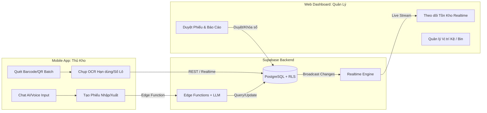
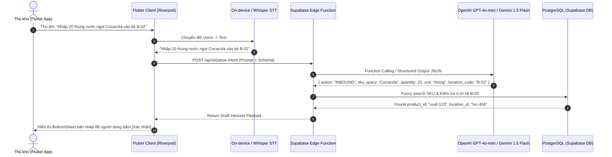
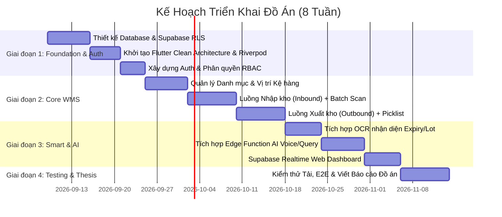

# Product Requirements Document (PRD)
## Hệ Thống Quản Lý Kho Hàng Thông Minh (Smart WMS)

**Nền tảng & Công nghệ**: Flutter (Mobile & Web), Supabase (PostgreSQL, Realtime, Edge Functions, Auth, Storage), Google ML Kit, LLM (Gemini 1.5 Flash / OpenAI GPT-4o-mini).  
**Kiến trúc phần mềm**: Clean Architecture + Feature-First kết hợp Riverpod State Management.

---

### 1. Executive Summary

- **Problem Statement**: Các kho hàng vừa và nhỏ hiện nay gặp tỷ lệ sai sót 8–15% trong khâu nhập/xuất do thao tác thủ công, tốn trung bình 3–5 phút để lập một phiếu kho bằng giấy/bàn phím và mất từ 10–20 phút để tra cứu vị trí sản phẩm khi không có hệ thống định vị tức thời.
- **Proposed Solution**: Ứng dụng Quản lý kho Đa nền tảng (Flutter Mobile & Flutter Web) tích hợp Backend-as-a-Service (Supabase) với khả năng quét mã vạch/QR hàng loạt (Batch Scanning), nhận diện ký tự quang học (OCR) để nhập kho tự động, cùng Trợ lý ảo AI (LLM & Embeddings) tra cứu tồn kho theo ngôn ngữ tự nhiên và chuyển giọng nói thành phiếu điều chuyển/nhập xuất.
- **Success Criteria**:
  - **Tốc độ xử lý nhập/xuất**: Giảm thời gian quét và tạo phiếu kho từ 3 phút xuống **< 25 giây/phiếu** (cho lô hàng 10 SKU).
  - **Độ chính xác quét mã & OCR**: Tỷ lệ giải mã Barcode/QR thành công đạt **$\ge 99.2\%$**; Độ chính xác nhận diện văn bản OCR cho số lô/hạn sử dụng đạt **$\ge 92.0\%$** trong điều kiện ánh sáng chuẩn ($\ge 150\text{ lux}$).
  - **Độ chính xác truy vấn AI**: Trợ lý ảo AI đạt **$\ge 90.0\%$** Precision trong việc trích xuất thực thể (SKU, số lượng, vị trí kệ) và chuyển đổi thành câu truy vấn cơ sở dữ liệu.
  - **Độ trễ đồng bộ dữ liệu**: Thời gian cập nhật tồn kho đa thiết bị qua Supabase Realtime đạt **$< 500\text{ms}$** trên mạng 4G/Wi-Fi thông thường.

---

### 2. User Experience & Functionality

#### 2.1. User Personas

| Persona | Vai trò | Mục tiêu chính | Điểm đau (Pain Points) | Thiết bị sử dụng |
| :--- | :--- | :--- | :--- | :--- |
| **Nguyễn Văn A (28t)** | Nhân viên thủ kho (Warehouse Operator) | Quét nhận hàng, xếp lên kệ, nhặt hàng xuất kho nhanh, không nhầm lẫn | Tay bận bê vác khó gõ bàn phím; quét từng mã rất chậm; hay quên vị trí kệ | Android / iOS Mobile App |
| **Trần Thị B (35t)** | Quản lý kho / Điều hành (Warehouse Manager) | Nắm bắt tổng quan tồn kho, duyệt phiếu nhập/xuất, cảnh báo sắp hết hàng | Báo cáo thủ công bị trễ; số liệu lệch giữa thực tế và sổ sách | Web Admin Dashboard |
| **Lê Hoàng C (40t)** | Quản trị viên hệ thống (System Admin) | Phân quyền nhân viên, cấu hình danh mục kho, quản lý API key & Logs | Khó kiểm soát lịch sử thao tác gian lận hoặc sửa đổi dữ liệu kho | Web Admin Dashboard |

---

#### 2.2. User Stories & Acceptance Criteria



##### Story 1: Quét mã vạch/QR hàng loạt & OCR khi Nhập kho (Inbound)
- **Story**: *Là một Thủ kho, tôi muốn quét liên tục nhiều mã Barcode/QR và quét OCR thông tin Hạn sử dụng/Số lô (Batch/Lot) từ camera điện thoại, để có thể hoàn tất việc nhập 20 mặt hàng vào kho trong vòng dưới 1 phút mà không cần nhập tay.*
- **Acceptance Criteria**:
  - Hỗ trợ giải mã đồng thời các chuẩn: `Code 128`, `EAN-13`, `QR Code`, `DataMatrix`.
  - Chế độ **Batch Scan**: Camera giữ luồng quét liên tục, mỗi lần quét hợp lệ phát tín hiệu Haptic Feedback (rung nhẹ) + Âm thanh Beep, tự động tăng số lượng (Count) nếu mã trùng nhau.
  - Chế độ **OCR Scan**: Nhận diện khung văn bản chứa chuỗi dạng ngày tháng `DD/MM/YYYY`, `EXP: ...`, `LOT: ...` với độ trễ phản hồi OCR trên thiết bị $\le 300\text{ms}$.
  - Tự động gợi ý Vị trí lưu kho (Zone - Aisle - Rack - Bin) còn trống phù hợp với nhóm hàng.

##### Story 2: Xuất kho theo đơn hàng (Outbound Picking & Dispatch)
- **Story**: *Là một Thủ kho, tôi muốn nhận danh sách sản phẩm cần lấy (Pick List) hiển thị kèm vị trí kệ chính xác và quét mã đối soát trước khi đóng gói, để đảm bảo không xuất sai mã hàng hoặc thiếu số lượng.*
- **Acceptance Criteria**:
  - Ứng dụng nhóm danh sách lấy hàng theo thứ tự vị trí kệ tối ưu để giảm quãng đường di chuyển.
  - Khi quét mã sản phẩm xuất kho:
    - Nếu đúng mã trong đơn: Tự động đánh dấu hoàn thành dòng sản phẩm và trừ tồn kho tạm giữ (Reserved Stock).
    - Nếu sai mã hoặc quét vượt số lượng yêu cầu: Ứng dụng phát âm thanh cảnh báo lỗi (Error Beep), hiển thị Modal đỏ chặn thao tác tiếp theo cho đến khi xác nhận hủy.
  - Khi hoàn tất lấy toàn bộ đơn: Trạng thái đơn đổi thành `Packed` / `Dispatched`, trừ số lượng thực tế trong cơ sở dữ liệu qua Database Transaction.

##### Story 3: Trợ lý ảo AI tra cứu tồn kho & Lập phiếu bằng giọng nói
- **Story**: *Là một Quản lý/Thủ kho, tôi muốn nói hoặc nhập một câu văn tự nhiên (ví dụ: "Nhập 50 bao xi măng Hà Tiên vào kệ A1") để hệ thống tự động bóc tách thông tin và tạo sẵn bản nháp phiếu kho, giúp tiết kiệm thao tác bấm form.*
- **Acceptance Criteria**:
  - Chuyển đổi giọng nói thành văn bản (Speech-to-Text) với độ trễ phản hồi $\le 1.5\text{s}$ trên thiết bị di động.
  - Xử lý ngôn ngữ tự nhiên trích xuất đúng 4 trường thông tin: `Hành động (Nhập/Xuất/Tra cứu)`, `Tên sản phẩm / Mã SKU`, `Số lượng`, `Vị trí/Đối tác`.
  - Hiển thị màn hình xem trước (Preview Draft Sheet) với các trường đã điền sẵn để người dùng bấm "Xác nhận tạo phiếu" (Human-in-the-loop, không tự ý ghi đè DB nếu chưa xác nhận).
  - Khả năng hỏi đáp tồn kho bằng tiếng Việt: *"Sản phẩm X còn bao nhiêu cái ở kho Tổng?"* -> Trả về kết quả chính xác trong $\le 2.0\text{s}$.

##### Story 4: Quản lý & Theo dõi Tồn kho Thời gian thực trên Web Dashboard
- **Story**: *Là một Quản lý kho, tôi muốn màn hình Web Dashboard tự động cập nhật số liệu ngay khi nhân viên dưới kho vừa quét xuất/nhập một kiện hàng mà không cần bấm F5 tải lại trang.*
- **Acceptance Criteria**:
  - Tích hợp Supabase Realtime Subscription: Dashboard phản ánh thay đổi tồn kho (Stock On Hand, Stock In Transit, Out of Stock) với độ trễ $< 500\text{ms}$.
  - Cảnh báo trực quan (Badge màu đỏ/vàng) đối với các mặt hàng có tồn kho dưới Định mức An toàn (Safety Stock).
  - Xuất báo cáo Xuất - Nhập - Tồn dạng Excel (`.xlsx`) và PDF theo chuẩn kế toán trong thời gian $< 2.0\text{s}$ cho 5,000 bản ghi.

---

#### 2.3. Non-Goals (Những gì KHÔNG xây dựng trong phạm vi đồ án)

- **Không tích hợp hệ thống băng chuyền tự động hóa phần cứng (AGV / AS/RS / PLC)**.
- **Không xây dựng cổng thanh toán trực tuyến hoặc chức năng kế toán tài chính chuyên sâu (thuế, công nợ phức tạp)**.
- **Không hỗ trợ in mã vạch trực tiếp qua giao thức Serial/LPT cũ** (chỉ hỗ trợ xuất file PDF nhãn in kích thước chuẩn A4/Decal nhiệt 100x150mm hoặc chia sẻ qua AirPrint/Bluetooth ESC/POS).

---

### 3. AI System Requirements

#### 3.1. Tool & API Specifications



- **Thị giác máy tính (Vision & Barcode)**:
  - **Mobile Scanner**: `mobile_scanner` (sử dụng Google ML Kit Barcode Scanning API cục bộ trên máy, không tốn chi phí mạng).
  - **OCR Engine**: Google ML Kit Text Recognition (`google_mlkit_text_recognition`) chạy on-device trên Flutter Mobile.
- **Hệ thống AI Xử lý Ngôn ngữ & Giọng nói**:
  - **Speech-to-Text (STT)**: `speech_to_text` (Flutter plugin sử dụng native speech engine iOS/Android) hoặc OpenAI Whisper API.
  - **LLM Gateway**: Supabase Edge Functions (Deno runtime) gọi mô hình **Gemini 1.5 Flash** hoặc **OpenAI GPT-4o-mini** với chế độ **Structured JSON Outputs (JSON Schema)**.
  - **Vector Search (Semantic Search)**: `pgvector` trên PostgreSQL của Supabase để tìm kiếm gần đúng sản phẩm khi người dùng nói tên không khớp 100% mã SKU.

#### 3.2. Evaluation Strategy (Đánh giá chất lượng AI)

- **Bộ dữ liệu đánh giá (Benchmark Dataset)**: Bộ 100 câu lệnh khẩu ngữ thực tế của thủ kho (bao gồm giọng địa phương, từ viết tắt, tiếng ồn môi trường kho).
- **Tiêu chí nghiệm thu (Acceptance Thresholds)**:
  - **Intent Classification Accuracy**: $\ge 95.0\%$ phân loại chính xác giữa 3 hành động (`INBOUND`, `OUTBOUND`, `QUERY_STOCK`).
  - **Entity Extraction F1-Score**: $\ge 90.0\%$ bóc tách chính xác đồng thời 3 thực thể: Sản phẩm, Số lượng, Vị trí.
  - **Fallback Handling**: Trong 100% trường hợp confidence score $< 0.7$, hệ thống **BẮT BUỘC** hiển thị form tìm kiếm thủ công kèm thông báo: *"Không nhận diện chắc chắn, vui lòng kiểm tra lại thông tin dưới đây."*

---

### 4. Technical Specifications

#### 4.1. Architecture Overview (Clean Architecture + Riverpod)

Dự án tuân thủ nghiêm ngặt **Clean Architecture** (phân tách 3 tầng độc lập) kết hợp mô hình **Feature-First**:

```
lib/
├── app/                  # App-level configs, routes, theme
├── core/                 # Shared utilities, constants, network exceptions
│   ├── network/          # Supabase client wrapper, interceptors
│   ├── utils/            # Barcode parser, date formatters
│   └── errors/           # Failure & Exception classes
└── features/             # Feature-First modules
    ├── auth/             # Authentication & Role Guard
    ├── inventory/        # Quản lý tồn kho & Tra cứu
    ├── inbound/          # Nhập kho & Batch/OCR Scanning
    ├── outbound/         # Xuất kho & Picklist Verification
    └── ai_assistant/     # Voice input, Chatbot, Edge function client
        ├── data/
        │   ├── datasources/    # Remote (Supabase/Edge Function) & Local
        │   ├── models/         # DTOs & JSON serialization (freezed)
        │   └── repositories/   # Implementation of Domain Repositories
        ├── domain/
        │   ├── entities/       # Pure Business Objects
        │   ├── repositories/   # Abstract Repository Interfaces
        │   └── usecases/       # Single-responsibility Business Actions
        └── presentation/
            ├── controllers/    # Riverpod AsyncNotifier / StateNotifier
            ├── states/         # UI State models
            └── widgets/        # UI Screens & Component widgets
```

---

#### 4.2. Database Schema (Supabase PostgreSQL DDL & RLS)

```sql
-- Kích hoạt extension hỗ trợ UUID và Vector Search
CREATE EXTENSION IF NOT EXISTS "uuid-ossp";
CREATE EXTENSION IF NOT EXISTS "vector";

-- 1. Bảng Phân quyền Người dùng (Users Profile liên kết auth.users)
CREATE TYPE user_role AS ENUM ('ADMIN', 'MANAGER', 'STAFF');

CREATE TABLE public.profiles (
    id UUID PRIMARY KEY REFERENCES auth.users(id) ON DELETE CASCADE,
    full_name TEXT NOT NULL,
    role user_role NOT NULL DEFAULT 'STAFF',
    phone_number TEXT,
    created_at TIMESTAMPTZ NOT NULL DEFAULT NOW()
);

-- 2. Danh mục Vị trí Kệ hàng (Warehouse Hierarchy)
CREATE TABLE public.locations (
    id UUID PRIMARY KEY DEFAULT uuid_generate_v4(),
    zone_code TEXT NOT NULL,       -- Ví dụ: 'A', 'B', 'COLD'
    aisle_code TEXT NOT NULL,      -- Ví dụ: '01', '02'
    rack_code TEXT NOT NULL,       -- Ví dụ: 'R1', 'R2'
    bin_code TEXT NOT NULL,        -- Ví dụ: 'B01', 'B02'
    location_barcode TEXT UNIQUE NOT NULL, -- Sinh tự động: 'A-01-R1-B01'
    max_capacity_kg NUMERIC(10, 2),
    created_at TIMESTAMPTZ NOT NULL DEFAULT NOW()
);

-- 3. Danh mục Sản phẩm & Vector Embeddings
CREATE TABLE public.products (
    id UUID PRIMARY KEY DEFAULT uuid_generate_v4(),
    sku TEXT UNIQUE NOT NULL,
    barcode TEXT UNIQUE NOT NULL,
    name TEXT NOT NULL,
    description TEXT,
    unit TEXT NOT NULL DEFAULT 'cái',
    min_safety_stock INT NOT NULL DEFAULT 10,
    embedding VECTOR(768), -- Phục vụ Semantic Search qua Gemini/OpenAI
    created_at TIMESTAMPTZ NOT NULL DEFAULT NOW(),
    updated_at TIMESTAMPTZ NOT NULL DEFAULT NOW()
);

-- 4. Bảng Tồn kho chi tiết theo Vị trí (Stock Balance)
CREATE TABLE public.inventory_items (
    id UUID PRIMARY KEY DEFAULT uuid_generate_v4(),
    product_id UUID NOT NULL REFERENCES public.products(id) ON DELETE RESTRICT,
    location_id UUID NOT NULL REFERENCES public.locations(id) ON DELETE RESTRICT,
    lot_number TEXT,
    expiry_date DATE,
    quantity_on_hand INT NOT NULL DEFAULT 0 CHECK (quantity_on_hand >= 0),
    quantity_reserved INT NOT NULL DEFAULT 0 CHECK (quantity_reserved >= 0),
    updated_at TIMESTAMPTZ NOT NULL DEFAULT NOW(),
    CONSTRAINT unique_product_location_lot UNIQUE (product_id, location_id, lot_number)
);

-- 5. Phiếu Xuất/Nhập Kho (Transactions)
CREATE TYPE order_type AS ENUM ('INBOUND', 'OUTBOUND');
CREATE TYPE order_status AS ENUM ('DRAFT', 'CONFIRMED', 'PROCESSING', 'COMPLETED', 'CANCELLED');

CREATE TABLE public.warehouse_orders (
    id UUID PRIMARY KEY DEFAULT uuid_generate_v4(),
    order_code TEXT UNIQUE NOT NULL, -- 'INB-20260909-001'
    type order_type NOT NULL,
    status order_status NOT NULL DEFAULT 'DRAFT',
    created_by UUID REFERENCES public.profiles(id),
    approved_by UUID REFERENCES public.profiles(id),
    note TEXT,
    created_at TIMESTAMPTZ NOT NULL DEFAULT NOW(),
    updated_at TIMESTAMPTZ NOT NULL DEFAULT NOW()
);

CREATE TABLE public.warehouse_order_items (
    id UUID PRIMARY KEY DEFAULT uuid_generate_v4(),
    order_id UUID NOT NULL REFERENCES public.warehouse_orders(id) ON DELETE CASCADE,
    product_id UUID NOT NULL REFERENCES public.products(id) ON DELETE RESTRICT,
    location_id UUID REFERENCES public.locations(id),
    lot_number TEXT,
    expiry_date DATE,
    expected_quantity INT NOT NULL CHECK (expected_quantity > 0),
    actual_quantity INT NOT NULL DEFAULT 0 CHECK (actual_quantity >= 0)
);

-- 6. Thiết lập Row Level Security (RLS)
ALTER TABLE public.profiles ENABLE ROW LEVEL SECURITY;
ALTER TABLE public.products ENABLE ROW LEVEL SECURITY;
ALTER TABLE public.inventory_items ENABLE ROW LEVEL SECURITY;
ALTER TABLE public.warehouse_orders ENABLE ROW LEVEL SECURITY;

-- Mọi nhân viên đã xác thực đều được quyền ĐỌC dữ liệu kho
CREATE POLICY "Allow authenticated read products" 
ON public.products FOR SELECT 
TO authenticated 
USING (true);

-- Chỉ MANAGER hoặc ADMIN mới được DUYỆT hoặc XÓA phiếu kho
CREATE POLICY "Allow manager/admin write orders" 
ON public.warehouse_orders FOR ALL 
TO authenticated 
USING (
    EXISTS (
        SELECT 1 FROM public.profiles 
        WHERE profiles.id = auth.uid() 
        AND profiles.role IN ('MANAGER', 'ADMIN')
    )
);

-- Nhân viên kho (STAFF) được tạo đơn DRAFT và cập nhật actual_quantity khi quét
CREATE POLICY "Allow staff create draft orders" 
ON public.warehouse_orders FOR INSERT 
TO authenticated 
WITH CHECK (auth.uid() = created_by);
```

---

#### 4.3. Transactional Inventory Update (PostgreSQL Stored Procedure)

Để tránh lỗi tranh chấp ghi (Race Condition) khi nhiều nhân viên cùng quét xuất kho một mặt hàng, nghiệp vụ trừ kho **bắt buộc** thực thi thông qua Stored Procedure nguyên tử:

```sql
CREATE OR REPLACE FUNCTION public.confirm_outbound_order(p_order_id UUID)
RETURNS VOID AS $$
DECLARE
    v_item RECORD;
BEGIN
    -- 1. Kiểm tra trạng thái đơn hàng
    IF NOT EXISTS (
        SELECT 1 FROM public.warehouse_orders 
        WHERE id = p_order_id AND status = 'PROCESSING'
    ) THEN
        RAISE EXCEPTION 'Đơn hàng không ở trạng thái hợp lệ để hoàn tất.';
    END IF;

    -- 2. Lặp qua từng item và trừ tồn kho với row-level lock (FOR UPDATE)
    FOR v_item IN (
        SELECT product_id, location_id, lot_number, actual_quantity 
        FROM public.warehouse_order_items 
        WHERE order_id = p_order_id
    ) LOOP
        -- Trừ tồn kho và đảm bảo không âm
        UPDATE public.inventory_items
        SET quantity_on_hand = quantity_on_hand - v_item.actual_quantity,
            updated_at = NOW()
        WHERE product_id = v_item.product_id 
          AND location_id = v_item.location_id 
          AND (lot_number = v_item.lot_number OR (lot_number IS NULL AND v_item.lot_number IS NULL));

        IF NOT FOUND THEN
            RAISE EXCEPTION 'Không tìm thấy tồn kho cho SKU tại vị trí yêu cầu.';
        END IF;
    END LOOP;

    -- 3. Cập nhật trạng thái đơn thành COMPLETED
    UPDATE public.warehouse_orders
    SET status = 'COMPLETED',
        updated_at = NOW()
    WHERE id = p_order_id;
END;
$$ LANGUAGE plpgsql SECURITY DEFINER;
```

---

#### 4.4. Integration & Security Specifications

- **Authentication**: Supabase Auth sử dụng chuẩn **JWT (JSON Web Token)** với thời gian sống của Access Token là `3600s` và Refresh Token xoay vòng (Token Rotation).
- **Communication Protocol**:
  - `HTTPS / RESTful` cho các thao tác CRUD tiêu chuẩn và gọi Edge Functions.
  - `WSS (WebSocket Secure)` cho Supabase Realtime Channel (`postgres_changes` trên bảng `inventory_items` và `warehouse_orders`).
- **Data Protection**:
  - Mã hóa toàn bộ dữ liệu trên đường truyền bằng TLS 1.3.
  - Áp dụng triệt để Supabase Row Level Security (RLS) để cô lập dữ liệu theo phân quyền (Role-based access).

---

### 5. Risks & Roadmap

#### 5.1. Phased Rollout Plan



- **Phase 1 (MVP - Tuần 1 đến Tuần 4)**:
  - Khởi tạo Base Project Flutter (Riverpod + GoRouter + Clean Architecture).
  - Cấu hình Supabase PostgreSQL, Authentication (Email & Password), RLS Policies.
  - Hoàn thành module Quản lý sản phẩm, Vị trí (Zone/Rack/Bin), Quét mã Barcode/QR bằng camera điện thoại.
  - Quy trình Inbound/Outbound cơ bản (tạo phiếu, quét đối soát, trừ tồn kho bằng Stored Procedure).
- **Phase 2 (Smart Features & Web Admin - Tuần 5 đến Tuần 7)**:
  - Tích hợp OCR (ML Kit) tự động bóc tách hạn sử dụng khi nhập kho.
  - Triển khai Supabase Edge Function kết nối LLM (Gemini/OpenAI) để nhận diện Intent từ Voice/Text và tạo Draft Order.
  - Xây dựng Web Dashboard (Flutter Web) hiển thị biểu đồ thống kê tồn kho và cập nhật số liệu Realtime.
- **Phase 3 (Optimization & Thesis Finalization - Tuần 8)**:
  - Đánh giá Benchmark hiệu năng (độ trễ quét, độ chính xác AI).
  - Đóng gói ứng dụng APK/IPA cho Mobile và deploy Web Admin lên Vercel/Supabase Hosting.
  - Hoàn thiện Báo cáo Đồ án (Thesis Report) và Slide thuyết minh trước Hội đồng.

---

#### 5.2. Technical Risks & Mitigation Strategies

| Rủi ro Kỹ thuật | Mức độ ảnh hưởng | Giải pháp kiểm soát (Mitigation Strategy) |
| :--- | :--- | :--- |
| **Tranh chấp dữ liệu (Race Condition)** khi nhiều người cùng quét xuất một mặt hàng | Cao (High) | Sử dụng PostgreSQL **Stored Procedure** với cơ chế khóa dòng `SELECT ... FOR UPDATE` và ràng buộc `CHECK (quantity_on_hand >= 0)`. |
| **Môi trường kho bị thiếu sáng hoặc mã vạch bị rách/mờ** | Trung bình (Medium) | Bật Flashlight toggle trực tiếp trong giao diện quét; tích hợp thuật toán tăng tương phản hình ảnh và cho phép chuyển đổi tức thì sang chế độ gõ mã tay có Search Gợi ý. |
| **LLM sinh kết quả sai lệch (Hallucination)** khi tạo phiếu kho | Cao (High) | Áp dụng **JSON Schema Strict Mode** cho LLM; Bắt buộc phải có bước **xác nhận thủ công (Human-in-the-loop Preview)** trước khi ghi dữ liệu vào Database. |
| **Chi phí API LLM vượt mức cho phép** | Thấp (Low) | Xử lý Text Recognition (OCR) và Barcode Scanner hoàn toàn **On-Device (ML Kit)**; Chỉ gọi Edge Function LLM khi người dùng thực hiện thao tác Chat/Voice. |
